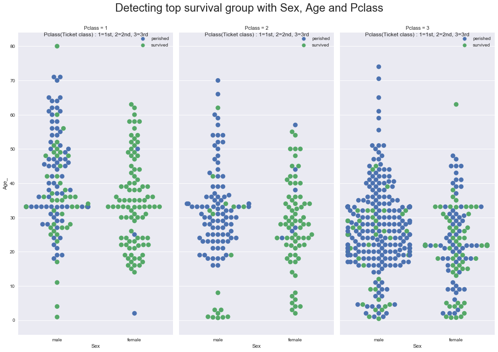

# Searching  characteristics of better-survived people in Titanic

Specifically, I would like to identify top 3 columns which have more correlation with 'Survived' = 1. 

## Data Wrangling

Among [2224 passengers and crews](https://en.wikipedia.org/wiki/RMS_Titanic), Kaggle.com published 891 people's record as 'titanic-data.csv' at  https://www.kaggle.com/c/titanic/data    
Column description : 
* survival	Survival	0 = No, 1 = Yes
* pclass	Ticket class	1 = 1st, 2 = 2nd, 3 = 3rd
* sex	Sex	
* Age	Age in years	
* sibsp	# of siblings / spouses aboard the Titanic	
* parch	# of parents / children aboard the Titanic	
* ticket	Ticket number	
* fare	Passenger fare	
* cabin	Cabin number	
* embarked	Port of Embarkation	C = Cherbourg, Q = Queenstown, S = Southampton

### DW1. Importing the data and a glance on sample records


```python
import pandas as pd
import numpy as np

%matplotlib inline
import matplotlib.pyplot as plt
from IPython.display import display

pd.set_option('display.max_columns', None)  
pd.set_option('display.max_colwidth', -1) 

df = pd.read_csv('titanic-data.csv')
print(df.shape)
display(df.columns)
display(df.sample(5))
```

    (891, 12)
    


    Index(['PassengerId', 'Survived', 'Pclass', 'Name', 'Sex', 'Age', 'SibSp',
           'Parch', 'Ticket', 'Fare', 'Cabin', 'Embarked'],
          dtype='object')


<div>
<table border="1" class="dataframe">
  <thead>
    <tr style="text-align: right;">
      <th></th>
      <th>PassengerId</th>
      <th>Survived</th>
      <th>Pclass</th>
      <th>Name</th>
      <th>Sex</th>
      <th>Age</th>
      <th>SibSp</th>
      <th>Parch</th>
      <th>Ticket</th>
      <th>Fare</th>
      <th>Cabin</th>
      <th>Embarked</th>
    </tr>
  </thead>
  <tbody>
    <tr>
      <th>720</th>
      <td>721</td>
      <td>1</td>
      <td>2</td>
      <td>Harper, Miss. Annie Jessie "Nina"</td>
      <td>female</td>
      <td>6.0</td>
      <td>0</td>
      <td>1</td>
      <td>248727</td>
      <td>33.0000</td>
      <td>NaN</td>
      <td>S</td>
    </tr>
    <tr>
      <th>268</th>
      <td>269</td>
      <td>1</td>
      <td>1</td>
      <td>Graham, Mrs. William Thompson (Edith Junkins)</td>
      <td>female</td>
      <td>58.0</td>
      <td>0</td>
      <td>1</td>
      <td>PC 17582</td>
      <td>153.4625</td>
      <td>C125</td>
      <td>S</td>
    </tr>
    <tr>
      <th>211</th>
      <td>212</td>
      <td>1</td>
      <td>2</td>
      <td>Cameron, Miss. Clear Annie</td>
      <td>female</td>
      <td>35.0</td>
      <td>0</td>
      <td>0</td>
      <td>F.C.C. 13528</td>
      <td>21.0000</td>
      <td>NaN</td>
      <td>S</td>
    </tr>
    <tr>
      <th>418</th>
      <td>419</td>
      <td>0</td>
      <td>2</td>
      <td>Matthews, Mr. William John</td>
      <td>male</td>
      <td>30.0</td>
      <td>0</td>
      <td>0</td>
      <td>28228</td>
      <td>13.0000</td>
      <td>NaN</td>
      <td>S</td>
    </tr>
    <tr>
      <th>887</th>
      <td>888</td>
      <td>1</td>
      <td>1</td>
      <td>Graham, Miss. Margaret Edith</td>
      <td>female</td>
      <td>19.0</td>
      <td>0</td>
      <td>0</td>
      <td>112053</td>
      <td>30.0000</td>
      <td>B42</td>
      <td>S</td>
    </tr>
  </tbody>
</table>
</div>


### DW2. Looking for missing or duplicating data - Mostly fine but 'Age', 'Cabin' have many NaN values
PassengerId : No problem : min=1, max=891, count=891, therefore there is no missing data between 1 and 891  
Survived : No problem : no missing data and only unique values are found in [0 1]  
Pclass : No problem : no missing data and only unique values are found in [3 1 2]  
**Age** : 19% of NaN.  I will try to **replace the NaN with proper value**. Also, I will compare NaN-Age and non-NaN-Age passengers to understand **'Why NaN?' ** 
SibSp : No problem : no missing data and only unique values are found in [1 0 3 4 2 5 8]  
Parch : No problem : no missing data and only unique values are found in [0 1 2 5 3 4 6]  
Ticket : No problem : no missing data  
Fare : No problem ; no missing data  
**Cabin** : 77 % of NaN. Only 204 non-NaN 'Cabin' exist. It would be hard to get generalized information from 204 records to describe the whole 2224 passengers compared to 891. So **I won't touch NaN in 'Cabin' for now **. I think there could be a relationship among 'Ticket', 'Fare', 'Cabin' and 'Pclass' but it needs more understanding on the naming convention for 'Ticket' and 'Cabin' and corresponding 'Fare' and 'Pclass'. But next time.  
Embarked : No problem : Only 2 records are NaN and other values are all one of ['S','C','Q']  The two female passenters holding the same ticket - 113572, survived. There is no more person holding 113572


```python
""" 
Helper functions for overall understanding of the values of any DataFrame 
- report for NaN proportion, representative values, missing and duplicating values 

Use GetValueComposition to get to know actual data a little closer
Use CountDuplicatesForMustUniqueColumns to investigate the must-unique columns like key or id, name 
Sample codes 
    GetValueComposition(df)
    GetValueComposition(df, 10, False)  # top 10 most frequent unique values and cease plotting 
    CountDuplicatesForMustUniqueColumns(df, 'PassengerId')
"""
def GetNaNdistributionEachColumn(df) : 
    """ Number of Nan proportion and count will be returned   """
    sizedf = pd.DataFrame(df.apply(lambda sr: sr.size)).T
    newindex = sizedf.index.tolist()
    newindex[0] = 'Count.Row'
    sizedf.index = newindex 
    NonNaNdf = pd.DataFrame(df.apply(lambda sr: sr.count())).T
    newindex = NonNaNdf.index.tolist()
    newindex[0] = 'Count.NonNaN'
    NonNaNdf.index = newindex 
    NaNdf = pd.DataFrame(df.isnull().sum()).T 
    newindex = NaNdf.index.tolist()
    newindex[0] = 'Count.NaN'
    NaNdf.index = newindex 
    NaNpropdf = pd.DataFrame(df.isnull().sum()/len(df)).T.applymap(lambda x: round(x,2) if isinstance(x, (int, float, complex)) else x )
    newindex = NaNpropdf.index.tolist()
    newindex[0] = 'NaN Proportion'
    NaNpropdf.index = newindex 
    return pd.concat([sizedf, NonNaNdf, NaNdf, NaNpropdf], axis=0) 
def GetUniqueValuesCountForEachColumn(df) : 
    """ Unique values for each column"""
    uniquedf = pd.DataFrame(df.apply(lambda sr: len(sr.unique()))).T
    newindex = uniquedf.index.tolist()
    newindex[0] = 'Unique Values Count'
    uniquedf.index = newindex 
    return uniquedf
def GetTopUniqueValuesForEachColumn(df, TopN) : 
    """ Top N, frequent values. Obviously do not use on continuous columns """
    retdf = pd.DataFrame(df.apply(lambda sr: sr.value_counts().iloc[:TopN].to_json())).T   # result as json format
    newindex = retdf.index.tolist()
    newindex[0] = 'Unique Values Top {}'.format(TopN)
    retdf.index = newindex 
    return retdf

def GetValueComposition(df, TopN = 5, DrawPlot = True) :
    """ Top level function to get to know the values of each column holistically"""
    NanDF = GetNaNdistributionEachColumn(df)
    # Nan proportion plot 
    if DrawPlot : 
        X = NanDF.columns
        Y = NanDF.loc['NaN Proportion'] # or .iloc[3]
        plt.figure(1) 
        plt.xticks(range(len(X)), X)
        plt.bar(range(len(X)), Y)
        plt.suptitle("NaN proportion of each column", fontsize=16)
        locs, labels = plt.xticks()
        plt.setp(labels, rotation=90)
        plt.ylabel('NaN proportion')
        plt.show()
    DescDF = df.describe().applymap(lambda x: round(x,2) if isinstance(x, (int, float, complex)) else x )
    def display_pretty(df):
        """ Erase NaN and add 'new line' between the values """
        from IPython.display import display, HTML
        display( HTML( df.to_html().replace("|","<br>").replace(",", "<br>").replace("{", "").replace("}", "") ) )
    display_pretty(pd.concat([NanDF, GetUniqueValuesCountForEachColumn(df), GetTopUniqueValuesForEachColumn(df, TopN), DescDF], axis=0)) 

def CountDuplicatesForMustUniqueColumns(df, MustUniqueColumnList ) :
    """ checking duplicated row for Must-Unique columns"""
    if type(MustUniqueColumnList) != type([]) : MustUniqueColumnList = [MustUniqueColumnList]
    dupdf = df[MustUniqueColumnList].loc[df.duplicated(MustUniqueColumnList)]
    grpdf = dupdf.groupby(MustUniqueColumnList).count()
    DupCnt = len(grpdf)
    if DupCnt > 0 : 
        print( "{} group(s) of duplicated rows found for the must-unique column (".format(DupCnt) + ' '.join(str(e) for e in MustUniqueColumnList) 
              + "), values = " + str(grpdf.to_records().tolist())    )
    else : print( "No duplication in the column - " + ' '.join(str(e) for e in MustUniqueColumnList) )

# 
GetValueComposition(df, 10)

# searching any duplication
CountDuplicatesForMustUniqueColumns(df, 'PassengerId')
CountDuplicatesForMustUniqueColumns(df, 'Name')
```


<table border="1" class="dataframe">
  <thead>
    <tr style="text-align: right;">
      <th></th>
      <th>Age</th>
      <th>Cabin</th>
      <th>Embarked</th>
      <th>Fare</th>
      <th>Name</th>
      <th>Parch</th>
      <th>PassengerId</th>
      <th>Pclass</th>
      <th>Sex</th>
      <th>SibSp</th>
      <th>Survived</th>
      <th>Ticket</th>
    </tr>
  </thead>
  <tbody>
    <tr>
      <th>Count.Row</th>
      <td>891</td>
      <td>891</td>
      <td>891</td>
      <td>891</td>
      <td>891</td>
      <td>891</td>
      <td>891</td>
      <td>891</td>
      <td>891</td>
      <td>891</td>
      <td>891</td>
      <td>891</td>
    </tr>
    <tr>
      <th>Count.NonNaN</th>
      <td>714</td>
      <td>204</td>
      <td>889</td>
      <td>891</td>
      <td>891</td>
      <td>891</td>
      <td>891</td>
      <td>891</td>
      <td>891</td>
      <td>891</td>
      <td>891</td>
      <td>891</td>
    </tr>
    <tr>
      <th>Count.NaN</th>
      <td>177</td>
      <td>687</td>
      <td>2</td>
      <td>0</td>
      <td>0</td>
      <td>0</td>
      <td>0</td>
      <td>0</td>
      <td>0</td>
      <td>0</td>
      <td>0</td>
      <td>0</td>
    </tr>
    <tr>
      <th>NaN Proportion</th>
      <td>0.2</td>
      <td>0.77</td>
      <td>0</td>
      <td>0</td>
      <td>0</td>
      <td>0</td>
      <td>0</td>
      <td>0</td>
      <td>0</td>
      <td>0</td>
      <td>0</td>
      <td>0</td>
    </tr>
    <tr>
      <th>Unique Values Count</th>
      <td>89</td>
      <td>148</td>
      <td>4</td>
      <td>248</td>
      <td>891</td>
      <td>7</td>
      <td>891</td>
      <td>3</td>
      <td>2</td>
      <td>7</td>
      <td>2</td>
      <td>681</td>
    </tr>
    <tr>
      <th>Unique Values Top 10</th>
      <td>"24.0":30<br>"22.0":27<br>"18.0":26<br>"28.0":25<br>"30.0":25<br>"19.0":25<br>"21.0":24<br>"25.0":23<br>"36.0":22<br>"29.0":20</td>
      <td>"B96 B98":4<br>"G6":4<br>"C23 C25 C27":4<br>"C22 C26":3<br>"F33":3<br>"F2":3<br>"E101":3<br>"D":3<br>"E67":2<br>"B22":2</td>
      <td>"S":644<br>"C":168<br>"Q":77</td>
      <td>"8.05":43<br>"13.0":42<br>"7.8958":38<br>"7.75":34<br>"26.0":31<br>"10.5":24<br>"7.925":18<br>"7.775":16<br>"0.0":15<br>"26.55":15</td>
      <td>"Dennis<br> Mr. Samuel":1<br>"Hewlett<br> Mrs. (Mary D Kingcome) ":1<br>"Meanwell<br> Miss. (Marion Ogden)":1<br>"Smith<br> Miss. Marion Elsie":1<br>"Sinkkonen<br> Miss. Anna":1<br>"Astor<br> Mrs. John Jacob (Madeleine Talmadge Force)":1<br>"Rice<br> Master. Eric":1<br>"Jardin<br> Mr. Jose Neto":1<br>"Jonkoff<br> Mr. Lalio":1<br>"Edvardsson<br> Mr. Gustaf Hjalmar":1</td>
      <td>"0":678<br>"1":118<br>"2":80<br>"5":5<br>"3":5<br>"4":4<br>"6":1</td>
      <td>"891":1<br>"293":1<br>"304":1<br>"303":1<br>"302":1<br>"301":1<br>"300":1<br>"299":1<br>"298":1<br>"297":1</td>
      <td>"3":491<br>"1":216<br>"2":184</td>
      <td>"male":577<br>"female":314</td>
      <td>"0":608<br>"1":209<br>"2":28<br>"4":18<br>"3":16<br>"8":7<br>"5":5</td>
      <td>"0":549<br>"1":342</td>
      <td>"CA. 2343":7<br>"347082":7<br>"1601":7<br>"CA 2144":6<br>"347088":6<br>"3101295":6<br>"S.O.C. 14879":5<br>"382652":5<br>"PC 17757":4<br>"17421":4</td>
    </tr>
    <tr>
      <th>count</th>
      <td>714</td>
      <td>NaN</td>
      <td>NaN</td>
      <td>891</td>
      <td>NaN</td>
      <td>891</td>
      <td>891</td>
      <td>891</td>
      <td>NaN</td>
      <td>891</td>
      <td>891</td>
      <td>NaN</td>
    </tr>
    <tr>
      <th>mean</th>
      <td>29.7</td>
      <td>NaN</td>
      <td>NaN</td>
      <td>32.2</td>
      <td>NaN</td>
      <td>0.38</td>
      <td>446</td>
      <td>2.31</td>
      <td>NaN</td>
      <td>0.52</td>
      <td>0.38</td>
      <td>NaN</td>
    </tr>
    <tr>
      <th>std</th>
      <td>14.53</td>
      <td>NaN</td>
      <td>NaN</td>
      <td>49.69</td>
      <td>NaN</td>
      <td>0.81</td>
      <td>257.35</td>
      <td>0.84</td>
      <td>NaN</td>
      <td>1.1</td>
      <td>0.49</td>
      <td>NaN</td>
    </tr>
    <tr>
      <th>min</th>
      <td>0.42</td>
      <td>NaN</td>
      <td>NaN</td>
      <td>0</td>
      <td>NaN</td>
      <td>0</td>
      <td>1</td>
      <td>1</td>
      <td>NaN</td>
      <td>0</td>
      <td>0</td>
      <td>NaN</td>
    </tr>
    <tr>
      <th>25%</th>
      <td>20.12</td>
      <td>NaN</td>
      <td>NaN</td>
      <td>7.91</td>
      <td>NaN</td>
      <td>0</td>
      <td>223.5</td>
      <td>2</td>
      <td>NaN</td>
      <td>0</td>
      <td>0</td>
      <td>NaN</td>
    </tr>
    <tr>
      <th>50%</th>
      <td>28</td>
      <td>NaN</td>
      <td>NaN</td>
      <td>14.45</td>
      <td>NaN</td>
      <td>0</td>
      <td>446</td>
      <td>3</td>
      <td>NaN</td>
      <td>0</td>
      <td>0</td>
      <td>NaN</td>
    </tr>
    <tr>
      <th>75%</th>
      <td>38</td>
      <td>NaN</td>
      <td>NaN</td>
      <td>31</td>
      <td>NaN</td>
      <td>0</td>
      <td>668.5</td>
      <td>3</td>
      <td>NaN</td>
      <td>1</td>
      <td>1</td>
      <td>NaN</td>
    </tr>
    <tr>
      <th>max</th>
      <td>80</td>
      <td>NaN</td>
      <td>NaN</td>
      <td>512.33</td>
      <td>NaN</td>
      <td>6</td>
      <td>891</td>
      <td>3</td>
      <td>NaN</td>
      <td>8</td>
      <td>1</td>
      <td>NaN</td>
    </tr>
  </tbody>
</table>


    No duplication in the column - PassengerId
    No duplication in the column - Name
    

### DW3. Age (NaN vs non-NaN) groups are constitutionally the same? If so, we might be able to assign average age to NaN-age   
To tap on the idea, statistical hypothesis test will be done : 
* Chi-square test for categorical data column - 'Sex', 'Survived', 'SibSp', 'Parch', 'Pclass', 'Embarked'
* t-test for continuous data column - 'Fare'  

#### DW3.1. Chi-Square-test on 'Age' - (NaN vs Non-NaN), says the two groups are different 
'Age' = NaN group was more - male, died, traveled alone, 3rd classed, embarked at Queenstown 

* Null hypothesis 'the two groups are no different' was rejected because p-values are mostly far below alpha level = 0.05.
* p-value of 'Sex' is 0.068,  slightly above 0.05
* In case of 'SibSp', 'Parch', there are some category of frequency below 5. So, for the proper ChiSquare test, new columns were created which gathered number from adjacent similar categories to outnumber 5  
* Chi-square table : https://www.medcalc.org/manual/chi-square-table.php


```python
"""
Helper functions for Chi-square Test 

Use ChiSquareTestOnColumns to Chi-square test for any DataFrame, on two troups divided by DivCol, specifying curious columns at ChiTestColumns. 
Use ChiSquareTestTitanic only here, it is tailored version of ChiSquareTestOnColumns for Titanic. 
Sample codes 
    ChiSquareTestOnColumns (df, 'Age', ['Sex', 'Survived']) # chi-square test on the two groups - NaN-Age and non-NaN-Age, centered on 'Sex', 'Survived'
    ChiSquareTestTitanic(df, 'Age') 

"""
def ChiSquareTestOnColumns(df, DivCol, ChiTestColumns) : 
    """ Returns ChiSquare results. DivCol is the factor that might reject null hypothesis(nothing changed by the factor) """
    def EachDfGroupFunc(df):
        def GetNumbers(sr) : 
            eachcounts = sr.value_counts()  
            total = pd.Series([sr.count()], index=['total']) 
            return eachcounts.append(total)            
        return df.apply( GetNumbers )
    Cdf_raw = df[ChiTestColumns].groupby(lambda x: 'NaN' if pd.isnull(df[DivCol].loc[x]) else 'NonNaN' ).apply(EachDfGroupFunc) \
                .unstack().dropna(axis=1,how='all').fillna(0)    
    def EachDfGroupFunc_count(df):
        def GetNumbers(sr) : 
            eachcounts = sr.value_counts()  
            total = pd.Series([sr.count()], index=['total']) 
            return eachcounts.append(total)
        return df.apply( GetNumbers )
    Cdf_count = df[ChiTestColumns].groupby(lambda x: 'Observed' if pd.isnull(df[DivCol].loc[x]) else 'Expected' ).apply(EachDfGroupFunc_count) \
                .unstack().dropna(axis=1,how='all').fillna(0)
    def EachDfGroupFunc_ratio(df):
        def GetNumbers(sr) : 
            total = pd.Series([1], index=['total']) 
            eachratios = sr.value_counts() / sr.count() 
            eachratios = eachratios.apply(lambda v: round(v, 4))
            return eachratios.append(total)
        return df.apply( GetNumbers )
    Cdf_ratio = df[ChiTestColumns].groupby(lambda x: 'Observed_ratio' if pd.isnull(df[DivCol].loc[x]) else 'Expected_ratio' ).apply(EachDfGroupFunc_ratio) \
                .unstack().dropna(axis=1,how='all').fillna(0)
    # Now, required data is all prepared
    Cdf = pd.concat([Cdf_raw, Cdf_count, Cdf_ratio], axis=0).loc[['NaN', 'NonNaN', 'Observed', 'Expected_ratio'], :]

    # calculate the Chisquare and p value
    Cdf.loc['Expected'] = np.nan
    Cdf.loc['ChiSquare'] = np.nan
    Cdf.loc['DoF'] = np.nan
    Cdf.loc['P'] = np.nan
    
    def CalculateChiSquareAndP(Cdf, columns) : 
        import scipy.stats as st
        for col in columns : 
            Cdf.loc['Expected', col].update(Cdf.loc['Expected_ratio', col] * Cdf.loc['Observed', (col, 'total')])
            Cdf.loc['ChiSquare', col].update(  ((Cdf.loc['Observed', col] - Cdf.loc['Expected', col])**2)/ Cdf.loc['Expected', col]  )
            Cdf.loc['ChiSquare', (col,'total')] =  Cdf.loc['ChiSquare', col].sum()  
            Cdf.loc['DoF', (col,'total')] =  ( Cdf.loc[['Observed'], col].size - 1 ) - 1  # - 1 : excluding 'total' column
            Cdf.loc['P', (col,'total')] =     st.chi2.sf(Cdf.loc['ChiSquare', (col,'total')], Cdf.loc['DoF', (col, 'total')])

    CalculateChiSquareAndP(Cdf, ChiTestColumns)
    Cdf = Cdf.applymap(lambda x:  '' if pd.isnull(x) else round(x,4) if isinstance(x, (int, float, complex)) else x   )
    display(Cdf)
    return Cdf

#####################################
def ChiSquareTestTitanic(df, DivCol, ChiTestColumns = ['Sex', 'Survived', 'SibSp_', 'Parch_', 'Pclass', 'Embarked']) :
    """ Titanic project specific function for convenience. Use here only"""
    # in case of SibSp, Parch, there are some category of frequency below 5, 
    # so for proper ChiSquare test, new columns were created which gathered number with adjacent similar category to outnumber 5  
    df['SibSp_'] = df['SibSp'].apply(lambda x: 3 if x in [3,4,5,6,7,8] else x )
    df['Parch_'] = df['Parch'].apply(lambda x: 3 if x in [3,4,5,6] else x )
    ChiSquareTestOnColumns(df, DivCol, ChiTestColumns)
    df.drop(['SibSp_', 'Parch_'], axis=1, inplace=True)
    
#
ChiSquareTestTitanic(df, 'Age')

```


<div>
<table border="1" class="dataframe">
  <thead>
    <tr>
      <th></th>
      <th colspan="3" halign="left">Sex</th>
      <th colspan="3" halign="left">Survived</th>
      <th colspan="5" halign="left">SibSp_</th>
      <th colspan="5" halign="left">Parch_</th>
      <th colspan="4" halign="left">Pclass</th>
      <th colspan="4" halign="left">Embarked</th>
    </tr>
    <tr>
      <th></th>
      <th>female</th>
      <th>male</th>
      <th>total</th>
      <th>0</th>
      <th>1</th>
      <th>total</th>
      <th>0</th>
      <th>1</th>
      <th>2</th>
      <th>3</th>
      <th>total</th>
      <th>0</th>
      <th>1</th>
      <th>2</th>
      <th>3</th>
      <th>total</th>
      <th>1</th>
      <th>2</th>
      <th>3</th>
      <th>total</th>
      <th>C</th>
      <th>Q</th>
      <th>S</th>
      <th>total</th>
    </tr>
  </thead>
  <tbody>
    <tr>
      <th>NaN</th>
      <td>53</td>
      <td>124</td>
      <td>177.0000</td>
      <td>125</td>
      <td>52</td>
      <td>177.0000</td>
      <td>137</td>
      <td>26</td>
      <td>3</td>
      <td>11</td>
      <td>177.0000</td>
      <td>157</td>
      <td>8</td>
      <td>12</td>
      <td>0</td>
      <td>177.0000</td>
      <td>30</td>
      <td>11</td>
      <td>136</td>
      <td>177.0000</td>
      <td>38</td>
      <td>49</td>
      <td>90</td>
      <td>177.000</td>
    </tr>
    <tr>
      <th>NonNaN</th>
      <td>261</td>
      <td>453</td>
      <td>714.0000</td>
      <td>424</td>
      <td>290</td>
      <td>714.0000</td>
      <td>471</td>
      <td>183</td>
      <td>25</td>
      <td>35</td>
      <td>714.0000</td>
      <td>521</td>
      <td>110</td>
      <td>68</td>
      <td>15</td>
      <td>714.0000</td>
      <td>186</td>
      <td>173</td>
      <td>355</td>
      <td>714.0000</td>
      <td>130</td>
      <td>28</td>
      <td>554</td>
      <td>712.000</td>
    </tr>
    <tr>
      <th>Observed</th>
      <td>53</td>
      <td>124</td>
      <td>177.0000</td>
      <td>125</td>
      <td>52</td>
      <td>177.0000</td>
      <td>137</td>
      <td>26</td>
      <td>3</td>
      <td>11</td>
      <td>177.0000</td>
      <td>157</td>
      <td>8</td>
      <td>12</td>
      <td>0</td>
      <td>177.0000</td>
      <td>30</td>
      <td>11</td>
      <td>136</td>
      <td>177.0000</td>
      <td>38</td>
      <td>49</td>
      <td>90</td>
      <td>177.000</td>
    </tr>
    <tr>
      <th>Expected_ratio</th>
      <td>0.3655</td>
      <td>0.6345</td>
      <td>1.0000</td>
      <td>0.5938</td>
      <td>0.4062</td>
      <td>1.0000</td>
      <td>0.6597</td>
      <td>0.2563</td>
      <td>0.035</td>
      <td>0.049</td>
      <td>1.0000</td>
      <td>0.7297</td>
      <td>0.1541</td>
      <td>0.0952</td>
      <td>0.021</td>
      <td>1.0000</td>
      <td>0.2605</td>
      <td>0.2423</td>
      <td>0.4972</td>
      <td>1.0000</td>
      <td>0.1826</td>
      <td>0.0393</td>
      <td>0.7781</td>
      <td>1.000</td>
    </tr>
    <tr>
      <th>Expected</th>
      <td>64.6935</td>
      <td>112.306</td>
      <td>177.0000</td>
      <td>105.103</td>
      <td>71.8974</td>
      <td>177.0000</td>
      <td>116.767</td>
      <td>45.3651</td>
      <td>6.195</td>
      <td>8.673</td>
      <td>177.0000</td>
      <td>129.157</td>
      <td>27.2757</td>
      <td>16.8504</td>
      <td>3.717</td>
      <td>177.0000</td>
      <td>46.1085</td>
      <td>42.8871</td>
      <td>88.0044</td>
      <td>177.0000</td>
      <td>32.3202</td>
      <td>6.9561</td>
      <td>137.724</td>
      <td>177.000</td>
    </tr>
    <tr>
      <th>ChiSquare</th>
      <td>2.1136</td>
      <td>1.2175</td>
      <td>3.3312</td>
      <td>3.7669</td>
      <td>5.5065</td>
      <td>9.2734</td>
      <td>3.5059</td>
      <td>8.2664</td>
      <td>1.6478</td>
      <td>0.6243</td>
      <td>14.0445</td>
      <td>6.0023</td>
      <td>13.6221</td>
      <td>1.3962</td>
      <td>3.717</td>
      <td>24.7376</td>
      <td>5.6277</td>
      <td>23.7085</td>
      <td>26.1757</td>
      <td>55.5118</td>
      <td>0.9981</td>
      <td>254.121</td>
      <td>16.5371</td>
      <td>271.656</td>
    </tr>
    <tr>
      <th>DoF</th>
      <td></td>
      <td></td>
      <td>1.0000</td>
      <td></td>
      <td></td>
      <td>1.0000</td>
      <td></td>
      <td></td>
      <td></td>
      <td></td>
      <td>3.0000</td>
      <td></td>
      <td></td>
      <td></td>
      <td></td>
      <td>3.0000</td>
      <td></td>
      <td></td>
      <td></td>
      <td>2.0000</td>
      <td></td>
      <td></td>
      <td></td>
      <td>2.000</td>
    </tr>
    <tr>
      <th>P</th>
      <td></td>
      <td></td>
      <td>0.0680</td>
      <td></td>
      <td></td>
      <td>0.0023</td>
      <td></td>
      <td></td>
      <td></td>
      <td></td>
      <td>0.0028</td>
      <td></td>
      <td></td>
      <td></td>
      <td></td>
      <td>0.0000</td>
      <td></td>
      <td></td>
      <td></td>
      <td>0.0000</td>
      <td></td>
      <td></td>
      <td></td>
      <td>0.000</td>
    </tr>
  </tbody>
</table>
</div>


#### DW3.2. t-test on 'Age' - (NaN vs Non-NaN), says the two groups are different
'Age'=NaN group is lower fare passengers

* Null hypothesis (means of the two groups are the same) is rejected as the p-value is far below alpha level = 0.05.  
* It is a typical case of Independent Two Samples T-test with Unpooled Variance
* t-tested on 'Survived' which was Chi-square tested previously. The t-test p-value here is 0.004, so the previous conclusion was verified.  
* t-table : https://www.medcalc.org/manual/t-distribution.php 


```python
"""
Helper functions for t-Test on NaN-age and Non-NaN-age group 

Usage are similar to ChiSquareTestOnColumns
Use TTestIndependentOnColumns for any DataFrame - specify DivCol which divide the two groups under testing
Use TTestTitanic here only
Sample codes 
    TTestIndependentOnColumns(df, 'Age', ['Fare','Survived'])
    TTestTitanic(df, 'Age', ['Fare','Survived'])
"""
def TTestIndependentOnColumns(df, DivCol, TTestColumns) :    
    """ top level function, to ttest on any DataFrame. Specify DivCol which can reject the Ho, and columns in TTestColumns """
    def GetStandardErrorForTwoGroups(df, group1rowindex, group2rowindex, L0colname, L1stdcol = 'std', L1countcol='count', pooledvariance=False) :
        std1 = df[[(L0colname, L1stdcol)]].loc[group1rowindex].values[0]
        N1 = df[[(L0colname, L1countcol)]].loc[group1rowindex].values[0] * 1.0  
        std2 = df[[(L0colname, L1stdcol)]].loc[group2rowindex].values[0]
        N2 = df[[(L0colname, L1countcol)]].loc[group2rowindex].values[0] * 1.0
        if pooledvariance == False : return (  std1**2/N1 + std2**2/N2 )**(0.5) 
        else : return (  (((std1**2)*(N1-1) + (std2**2)*(N2-1))/(N1 + N2 - 2))*(1/N1 + 1/N2) )**(0.5)    

    def GetDoFvalue(df, group1rowindex, group2rowindex, L0colname, L1countcol='count') :
        degreeoffreedom = df[[(L0colname, L1countcol)]].loc[group1rowindex].values[0] + df[[(L0colname, L1countcol)]].loc[group2rowindex].values[0] - 2
        return degreeoffreedom

    def GetTvalue(df, group1rowindex, group2rowindex, L0colname, L1meancol = 'mean', L1SEcol='SE') :
        mean1 = df[[(L0colname, L1meancol)]].loc[group1rowindex].values[0] 
        mean2 = df[[(L0colname, L1meancol)]].loc[group2rowindex].values[0]   
        SE = df[[(L0colname, L1SEcol)]].loc[group1rowindex].values[0] * 1.0
        return  (mean1 - mean2) / SE

    import scipy.stats as st
    def GetPvalue(df, group1rowindex, group2rowindex, L0colname, L1tcol = 't', L1countcol='count', twotailed=True) :
        tvalue = df[[(L0colname, L1tcol)]].loc[group1rowindex].values[0]
        degreeoffreedom =GetDoFvalue(df, group1rowindex, group2rowindex, L0colname, L1countcol)
        pval = 0
        if twotailed == True : pval = st.t.sf(x= np.abs(tvalue), df= degreeoffreedom) * 2   # Mupltiply by two for two tailed test
        else :      pval = st.t.sf(x= np.abs(tvalue), df= degreeoffreedom)    
        return round(pval,4)
    
    Tdf = df[TTestColumns].groupby(lambda x: 'NaN' if pd.isnull(df[DivCol].loc[x]) else 'NonNaN' ).agg(['mean', 'std', 'count'])
    for col in TTestColumns :
        Tdf[(col, 'SE')] = GetStandardErrorForTwoGroups(Tdf, 'NaN', 'NonNaN', col)
        Tdf[(col, 'DoF')] = GetDoFvalue(Tdf, 'NaN', 'NonNaN', col)
        Tdf[(col, 't')] = GetTvalue(Tdf, 'NaN', 'NonNaN', col)
        Tdf[(col, 'p')] = GetPvalue(Tdf, 'NaN', 'NonNaN', col)
    Tdf = Tdf.stack().unstack()
    return Tdf

#####################################
def TTestTitanic(df, DivCol, TTestColumns = ['Fare']) :
    """ Titanic project specific function for convenience. Use here only"""
    display(TTestIndependentOnColumns(df, DivCol, TTestColumns))
    
TTestTitanic(df, 'Age', ['Fare','Survived'])
```


<div>
<table border="1" class="dataframe">
  <thead>
    <tr>
      <th></th>
      <th colspan="7" halign="left">Fare</th>
      <th colspan="7" halign="left">Survived</th>
    </tr>
    <tr>
      <th></th>
      <th>mean</th>
      <th>std</th>
      <th>count</th>
      <th>SE</th>
      <th>DoF</th>
      <th>t</th>
      <th>p</th>
      <th>mean</th>
      <th>std</th>
      <th>count</th>
      <th>SE</th>
      <th>DoF</th>
      <th>t</th>
      <th>p</th>
    </tr>
  </thead>
  <tbody>
    <tr>
      <th>NaN</th>
      <td>22.158567</td>
      <td>31.874608</td>
      <td>177.0</td>
      <td>3.108409</td>
      <td>889.0</td>
      <td>-4.032914</td>
      <td>0.0001</td>
      <td>0.293785</td>
      <td>0.456787</td>
      <td>177.0</td>
      <td>0.03895</td>
      <td>889.0</td>
      <td>-2.885148</td>
      <td>0.004</td>
    </tr>
    <tr>
      <th>NonNaN</th>
      <td>34.694514</td>
      <td>52.918930</td>
      <td>714.0</td>
      <td>3.108409</td>
      <td>889.0</td>
      <td>-4.032914</td>
      <td>0.0001</td>
      <td>0.406162</td>
      <td>0.491460</td>
      <td>714.0</td>
      <td>0.03895</td>
      <td>889.0</td>
      <td>-2.885148</td>
      <td>0.004</td>
    </tr>
  </tbody>
</table>
</div>


### However, histogram looks the two groups are similar  
Statistically the two groups are different and I imagine a story based on future (not this time) analysis, for example their location in Titanic supposing that it sank from the behind, or some mistakes that took place more at Queenstown.  
However for now, let's assume the two groups are similar as the histogram shows. So, the conclusion : strictly speaking they are different but NOT that BIG different to discard the whole 177 records.  
For now, let's just understand 'Age' = NaN group was more - male, died, traveled alone, 3rd Pclassed, embarked at Queenstown and lower fare passengers. 
Then, I will take another approach using 'Name' column to fill NaN-age.  


```python
def PlotHistBar(df, DivCol, DivColNaN, OrderedCols, BarPlotCols, OverallTitle, YLabel):
    """ 
    Plotting histogram and Bar chart together for many diverse columns to get to know overall trends on one figure
    Seperating group by columns that have NaN value, will show some insight about the other columns 
    
    DivCol is the separator. 
    DivColNaN = True then the function will plot NaN group, False will plot non-NaN group
    BarPlotCols is list of categorical data like 'male'/'female', 'S'/'C'/'Q'
    
    Sample : 
    PlotHistBar(df, 'Age', False, ['Sex', 'Survived', 'SibSp', 'Parch', 'Pclass', 'Embarked', 'Fare'], ['Sex','Embarked'], \
            'Histogram of other columns, in case of Age=Non-NaN', 'No. of passengers')
    """
    dfcols = df[df[DivCol].isnull() if DivColNaN else df[DivCol].notnull()][OrderedCols]
    fig, axes = plt.subplots(1, len(OrderedCols),figsize=(24,6))
    i = 0 
    for ax in axes : 
        if i >= len(OrderedCols) : break
        col = OrderedCols[i]  
        if col in BarPlotCols : 
            srbar = dfcols.loc[:,col].value_counts()
            ax.set_xticks(range(len(srbar.index)))
            ax.set_xticklabels(srbar.index)
            ax.bar(range(len(srbar.index)), srbar.values, align='center', width=0.35, label=YLabel)
        else : 
            ax.hist(dfcols.loc[:,col].values, 4, histtype='bar', label=YLabel, linewidth=1, edgecolor='white')
        ax.set_title(col)
        ax.legend()
        i += 1
    plt.suptitle(OverallTitle, fontsize=24, y=1.05, horizontalalignment='center')    
    plt.show()

###########################
PlotHistBar(df, 'Age', False, ['Sex', 'Survived', 'SibSp', 'Parch', 'Pclass', 'Embarked', 'Fare'], ['Sex','Embarked'], \
            'Histogram of other columns, in case of Age=Non-NaN', 'No. of passengers')

PlotHistBar(df, 'Age', True, ['Sex', 'Survived', 'SibSp', 'Parch', 'Pclass', 'Embarked', 'Fare'], ['Sex','Embarked'], \
            'Histogram of other columns, in case of Age=NaN', 'No. of passengers')


```


### DW4. Updating every 'Age'=NaN passengers with average age of Non-NaN using 'Mr/Miss/...' in 'Name' column  
As it turns out passengers with NO 'Mr.','Mrs.','Ms.','Miss.','Master.','Dr.' is just 17, and that 17 have all non-NaN 'Age', we can assign average age for each 'Mr.','Mrs.','Ms.','Miss.','Master.','Dr.' from the 'Name' column, leaving no NaN in Age column.    
* The new column is 'Age_'
* Earlier, I found out statistically the NaN-age group is different from non-NaN. So this update can be a blunt approach. 


```python
adults = ['Mr.','Mrs.','Ms.','Miss.','Master.','Dr.']
def MissMrDiff(x) : 
    """ generates a DataFrame to show the average age after dividing by RegEx"""
    for m in adults : 
        if df[['Name']].loc[x].str.contains(m).values[0]  : return m 
    return 'NonMissMr' 
Agedf = df[df['Age'].notnull()][['Name','Age']].groupby(MissMrDiff).agg(['size','mean'])
display(Agedf)

def MissMrAge(nmsr) :
    """ get the correct age from Agedf for the 'Name' data (pd.Series)"""
    agefit = np.nan
    for m in adults : 
        if nmsr.iloc[0].find(m) >= 0 :  agefit = Agedf.loc[m, ('Age','mean')]
    return round(agefit,2)

df['Age_'] = df[df['Age'].isnull()][['Name']].groupby(MissMrDiff).transform(MissMrAge)
df.loc[df['Age_'].isnull(), 'Age_'] = df.loc[df['Age_'].isnull(), 'Age']

print('5 samples to check Age_')
display(df[df['Age'].isnull()][['Age','Age_','Name']].sample(5))
```


<div>
<table border="1" class="dataframe">
  <thead>
    <tr>
      <th></th>
      <th colspan="2" halign="left">Age</th>
    </tr>
    <tr>
      <th></th>
      <th>size</th>
      <th>mean</th>
    </tr>
  </thead>
  <tbody>
    <tr>
      <th>Dr.</th>
      <td>6</td>
      <td>42.000000</td>
    </tr>
    <tr>
      <th>Master.</th>
      <td>36</td>
      <td>4.574167</td>
    </tr>
    <tr>
      <th>Miss.</th>
      <td>144</td>
      <td>21.777778</td>
    </tr>
    <tr>
      <th>Mr.</th>
      <td>511</td>
      <td>33.118395</td>
    </tr>
    <tr>
      <th>Ms.</th>
      <td>1</td>
      <td>28.000000</td>
    </tr>
    <tr>
      <th>NonMissMr</th>
      <td>16</td>
      <td>43.812500</td>
    </tr>
  </tbody>
</table>
</div>


    5 samples to check Age_
    


<div>
<table border="1" class="dataframe">
  <thead>
    <tr style="text-align: right;">
      <th></th>
      <th>Age</th>
      <th>Age_</th>
      <th>Name</th>
    </tr>
  </thead>
  <tbody>
    <tr>
      <th>358</th>
      <td>NaN</td>
      <td>21.78</td>
      <td>McGovern, Miss. Mary</td>
    </tr>
    <tr>
      <th>301</th>
      <td>NaN</td>
      <td>33.12</td>
      <td>McCoy, Mr. Bernard</td>
    </tr>
    <tr>
      <th>415</th>
      <td>NaN</td>
      <td>33.12</td>
      <td>Meek, Mrs. Thomas (Annie Louise Rowley)</td>
    </tr>
    <tr>
      <th>28</th>
      <td>NaN</td>
      <td>21.78</td>
      <td>O'Dwyer, Miss. Ellen "Nellie"</td>
    </tr>
    <tr>
      <th>201</th>
      <td>NaN</td>
      <td>33.12</td>
      <td>Sage, Mr. Frederick</td>
    </tr>
  </tbody>
</table>
</div>


## Data Exploration

### Correlation Coefficient between 'Survived' and other columns  
In superficial glance, 'Sex', 'Pclass', 'Fare' have something to do with 'Survived'  
Pclass has another correlation with Fare. It looks obvious.  
SibSp and Parch have some correlation. Probably, we could think of 'SibSp' + 'Parch' as a single concept - family size 
* The table highlighted absolute value of Correlation Coefficient above 3  
* 'Sex' was converted to integer into a new column 'Sex_' applying 'female'/'male'  = 1/0
* Categorical columns - 'Pclass', 'Cabin', 'Embarked' need more looking into   


```python
# new column to convert 'Sex' to integer
df['Sex_'] = df.apply(lambda row: 1 if row['Sex'] == 'female' else 0, axis=1)
dfsurvived = df[['Survived','Sex_','Age_','SibSp','Parch', 'Fare', 'Pclass', 'Cabin', 'Embarked']].corr()
display(dfsurvived.applymap(lambda c: '' if np.abs(c) < 0.4 else c ))
ax = dfsurvived['Survived'].plot(kind='bar')
ax.set_title('correlation of Survived(=1) and others ', fontsize=16)
ax.set_ylabel('Correlation Coefficient')
ax.text(0.4,0.6,'Sex : female=1, male=0')
ax.text(1.6,-0.2,'Age : NaN replaced with average age')
plt.show()
```


<div>
<table border="1" class="dataframe">
  <thead>
    <tr style="text-align: right;">
      <th></th>
      <th>Survived</th>
      <th>Sex_</th>
      <th>Age_</th>
      <th>SibSp</th>
      <th>Parch</th>
      <th>Fare</th>
      <th>Pclass</th>
    </tr>
  </thead>
  <tbody>
    <tr>
      <th>Survived</th>
      <td>1</td>
      <td>0.543351</td>
      <td></td>
      <td></td>
      <td></td>
      <td></td>
      <td></td>
    </tr>
    <tr>
      <th>Sex_</th>
      <td>0.543351</td>
      <td>1</td>
      <td></td>
      <td></td>
      <td></td>
      <td></td>
      <td></td>
    </tr>
    <tr>
      <th>Age_</th>
      <td></td>
      <td></td>
      <td>1</td>
      <td></td>
      <td></td>
      <td></td>
      <td></td>
    </tr>
    <tr>
      <th>SibSp</th>
      <td></td>
      <td></td>
      <td></td>
      <td>1</td>
      <td>0.414838</td>
      <td></td>
      <td></td>
    </tr>
    <tr>
      <th>Parch</th>
      <td></td>
      <td></td>
      <td></td>
      <td>0.414838</td>
      <td>1</td>
      <td></td>
      <td></td>
    </tr>
    <tr>
      <th>Fare</th>
      <td></td>
      <td></td>
      <td></td>
      <td></td>
      <td></td>
      <td>1</td>
      <td>-0.5495</td>
    </tr>
    <tr>
      <th>Pclass</th>
      <td></td>
      <td></td>
      <td></td>
      <td></td>
      <td></td>
      <td>-0.5495</td>
      <td>1</td>
    </tr>
  </tbody>
</table>
</div>


### Exploring each columns

### 1. 'Sex' column,  we see a clear tendency that famale survived better 


```python
"""
Helper function to report survival rate and plotting the analysis 

Use GetSurvivalRate and PlotSurvivalRateTable together 
to know survival rate in the correlation of a column
PlotSurvivalRateTable will draw the bar graph from the returned DataFrame 
Sample
    dfsurv = GetSurvivalRate(df, 'Sex')
    display(dfsurv)
    PlotSurvivalRateTable(dfsurv, 'Sex')
"""
def PlotSurvivalRateTable(dfcol, colnm) :
    """ plot the survival rate for each group"""
    fig, axes = plt.subplots(nrows=1, ncols=2)
    dfcol['SurvivalRate'].plot(kind='bar', legend=False, ax=axes[0])
    axes[0].set_title('Survival Rate along ' + colnm )
    axes[0].set_ylabel('Survival Rate')
    dfcol[['Survived','Died','Total']].plot(kind='bar', legend=True, figsize=(12,4), ax=axes[1])
    axes[1].set_title('Count along ' + colnm )
    axes[1].set_ylabel('No. of Passengers')
    plt.suptitle(colnm + ' and Survival', fontsize=16, y=1.05)
    plt.show()
    
def GetSurvivalRate(df, colnm) : 
    """ for categorical column """
    dfcol = df[['Survived',colnm]].loc[df['Survived'] == 1].groupby(colnm).count()
    dfcol['Died'] = df[['Survived',colnm]].loc[df['Survived'] == 0].groupby(colnm).count()
    dfcol['Total'] = df[['Survived',colnm]].groupby(colnm).count()
    dfcol['SurvivalRate'] = dfcol.apply(lambda row: row['Survived']/row['Total'], axis=1)
    return dfcol

def GetSurvivalRateByRange(df, colnm, rangelist) : 
    """ GetSurvivalRate for continuous data column """
    dfcol = df[['Survived']].groupby(pd.cut(df[colnm], rangelist)).apply(lambda daf: daf[daf['Survived'] == 1].count()/daf[['Survived']].count())
    dfcol.columns= ['SurvivalRate']
    dfcol['Survived'] = df[['Survived']].groupby(pd.cut(df[colnm], rangelist)).apply(lambda daf: daf[daf['Survived'] == 1].count())
    dfcol['Died'] = df[['Survived']].groupby(pd.cut(df[colnm], rangelist)).apply(lambda daf: daf[daf['Survived'] == 0].count())
    dfcol['Total'] = df[['Survived']].groupby(pd.cut(df[colnm], rangelist)).count()
    dfcol.index.name = colnm + 'Range'
    return dfcol[['Survived','Died','Total', 'SurvivalRate']]

########################
dfsurv = GetSurvivalRate(df, 'Sex')
display(dfsurv)
PlotSurvivalRateTable(dfsurv, 'Sex')
```


<div>
<table border="1" class="dataframe">
  <thead>
    <tr style="text-align: right;">
      <th></th>
      <th>Survived</th>
      <th>Died</th>
      <th>Total</th>
      <th>SurvivalRate</th>
    </tr>
    <tr>
      <th>Sex</th>
      <th></th>
      <th></th>
      <th></th>
      <th></th>
    </tr>
  </thead>
  <tbody>
    <tr>
      <th>female</th>
      <td>233</td>
      <td>81</td>
      <td>314</td>
      <td>0.742038</td>
    </tr>
    <tr>
      <th>male</th>
      <td>109</td>
      <td>468</td>
      <td>577</td>
      <td>0.188908</td>
    </tr>
  </tbody>
</table>
</div>


### 2.1 'Age' column.  Statistically Survived = 0 and 1 groups have different mean value 
When we compare the two groups - Survived = 0 and 1, statistically their Age compositions are different. 
* Null hypothesis (means of Survived 0 and 1 are the same) was rejected because p-value of the T-test is below alpha level 0.05  
* Just in case, T-test was done on both - 'Age\_' and 'Age' column. Results are the same. ('Age\_' is data-wrangled of 'Age')  
* Now, I get the Chi-square-test and T-test are too strict for data exploration phase. Just human eyes to check the similarity would do for this stage. 


```python
dfAge = df[['Age_','Age','Survived']].copy()  #allocated new DataFrame to manipulate 'Survived' column
dfAge.loc[dfAge['Survived'] == 0, ['Survived']] = np.nan  #because TTestIndependentOnColumns separate based on NaN and non-NaN, Survived=0 converted to NaN
dfAgeTtest = TTestIndependentOnColumns(dfAge, 'Survived', ['Age_','Age'])
dfAgeTtest = dfAgeTtest.rename({'NaN': 'Survived=0', 'NonNaN': 'Survived=1'})
display(dfAgeTtest)
```


<div>
<table border="1" class="dataframe">
  <thead>
    <tr>
      <th></th>
      <th colspan="7" halign="left">Age_</th>
      <th colspan="7" halign="left">Age</th>
    </tr>
    <tr>
      <th></th>
      <th>mean</th>
      <th>std</th>
      <th>count</th>
      <th>SE</th>
      <th>DoF</th>
      <th>t</th>
      <th>p</th>
      <th>mean</th>
      <th>std</th>
      <th>count</th>
      <th>SE</th>
      <th>DoF</th>
      <th>t</th>
      <th>p</th>
    </tr>
  </thead>
  <tbody>
    <tr>
      <th>Survived=0</th>
      <td>30.816976</td>
      <td>12.686094</td>
      <td>549.0</td>
      <td>0.932892</td>
      <td>889.0</td>
      <td>2.833657</td>
      <td>0.0047</td>
      <td>30.626179</td>
      <td>14.172110</td>
      <td>424.0</td>
      <td>1.11557</td>
      <td>712.0</td>
      <td>2.04603</td>
      <td>0.0411</td>
    </tr>
    <tr>
      <th>Survived=1</th>
      <td>28.173480</td>
      <td>14.049294</td>
      <td>342.0</td>
      <td>0.932892</td>
      <td>889.0</td>
      <td>2.833657</td>
      <td>0.0047</td>
      <td>28.343690</td>
      <td>14.950952</td>
      <td>290.0</td>
      <td>1.11557</td>
      <td>712.0</td>
      <td>2.04603</td>
      <td>0.0411</td>
    </tr>
  </tbody>
</table>
</div>


### 2.2 However, 'Age' under 5 has strong correlation with survival
Physical strength, which might have influenced survival, is not proportional to age, so let's split the Age into ranges, expecting that the people in physically active age (operationally defined as 15~60 here) might have bigger survival rate. However, the result is quite the contrary. 
* Age 10~15 (19 passengers) has the 2nd survival rate - 0.58. 


```python
dfAge = GetSurvivalRateByRange(df, 'Age', [0,5,10,15,20,30,45,50,60,100])
display(dfAge)
PlotSurvivalRateTable(dfAge, 'Age')
```


<div>
<table border="1" class="dataframe">
  <thead>
    <tr style="text-align: right;">
      <th></th>
      <th>Survived</th>
      <th>Died</th>
      <th>Total</th>
      <th>SurvivalRate</th>
    </tr>
    <tr>
      <th>AgeRange</th>
      <th></th>
      <th></th>
      <th></th>
      <th></th>
    </tr>
  </thead>
  <tbody>
    <tr>
      <th>(0, 5]</th>
      <td>31</td>
      <td>13</td>
      <td>44</td>
      <td>0.704545</td>
    </tr>
    <tr>
      <th>(5, 10]</th>
      <td>7</td>
      <td>13</td>
      <td>20</td>
      <td>0.350000</td>
    </tr>
    <tr>
      <th>(10, 15]</th>
      <td>11</td>
      <td>8</td>
      <td>19</td>
      <td>0.578947</td>
    </tr>
    <tr>
      <th>(15, 20]</th>
      <td>33</td>
      <td>63</td>
      <td>96</td>
      <td>0.343750</td>
    </tr>
    <tr>
      <th>(20, 30]</th>
      <td>84</td>
      <td>146</td>
      <td>230</td>
      <td>0.365217</td>
    </tr>
    <tr>
      <th>(30, 45]</th>
      <td>86</td>
      <td>116</td>
      <td>202</td>
      <td>0.425743</td>
    </tr>
    <tr>
      <th>(45, 50]</th>
      <td>16</td>
      <td>23</td>
      <td>39</td>
      <td>0.410256</td>
    </tr>
    <tr>
      <th>(50, 60]</th>
      <td>17</td>
      <td>25</td>
      <td>42</td>
      <td>0.404762</td>
    </tr>
    <tr>
      <th>(60, 100]</th>
      <td>5</td>
      <td>17</td>
      <td>22</td>
      <td>0.227273</td>
    </tr>
  </tbody>
</table>
</div>


### 3.1 'SibSp', most people traveled alone, people with 1 or 2 siblings had better survival rate, people with more than 3 siblings had lower survival rate than people alone 


```python
dfsurv = GetSurvivalRate(df, 'SibSp')
display(dfsurv)
PlotSurvivalRateTable(dfsurv, 'SibSp')
```


<div>
<table border="1" class="dataframe">
  <thead>
    <tr style="text-align: right;">
      <th></th>
      <th>Survived</th>
      <th>Died</th>
      <th>Total</th>
      <th>SurvivalRate</th>
    </tr>
    <tr>
      <th>SibSp</th>
      <th></th>
      <th></th>
      <th></th>
      <th></th>
    </tr>
  </thead>
  <tbody>
    <tr>
      <th>0</th>
      <td>210</td>
      <td>398</td>
      <td>608</td>
      <td>0.345395</td>
    </tr>
    <tr>
      <th>1</th>
      <td>112</td>
      <td>97</td>
      <td>209</td>
      <td>0.535885</td>
    </tr>
    <tr>
      <th>2</th>
      <td>13</td>
      <td>15</td>
      <td>28</td>
      <td>0.464286</td>
    </tr>
    <tr>
      <th>3</th>
      <td>4</td>
      <td>12</td>
      <td>16</td>
      <td>0.250000</td>
    </tr>
    <tr>
      <th>4</th>
      <td>3</td>
      <td>15</td>
      <td>18</td>
      <td>0.166667</td>
    </tr>
  </tbody>
</table>
</div>


### 3.2 'Parch', most people traveled alone, people with 1~3 parents/children had better survival rate, people with more than 3 siblings had lower survival rate than people alone 


```python
dfsurv = GetSurvivalRate(df, 'Parch')
display(dfsurv)
PlotSurvivalRateTable(dfsurv, 'Parch')
```


<div>
<table border="1" class="dataframe">
  <thead>
    <tr style="text-align: right;">
      <th></th>
      <th>Survived</th>
      <th>Died</th>
      <th>Total</th>
      <th>SurvivalRate</th>
    </tr>
    <tr>
      <th>Parch</th>
      <th></th>
      <th></th>
      <th></th>
      <th></th>
    </tr>
  </thead>
  <tbody>
    <tr>
      <th>0</th>
      <td>233</td>
      <td>445</td>
      <td>678</td>
      <td>0.343658</td>
    </tr>
    <tr>
      <th>1</th>
      <td>65</td>
      <td>53</td>
      <td>118</td>
      <td>0.550847</td>
    </tr>
    <tr>
      <th>2</th>
      <td>40</td>
      <td>40</td>
      <td>80</td>
      <td>0.500000</td>
    </tr>
    <tr>
      <th>3</th>
      <td>3</td>
      <td>2</td>
      <td>5</td>
      <td>0.600000</td>
    </tr>
    <tr>
      <th>5</th>
      <td>1</td>
      <td>4</td>
      <td>5</td>
      <td>0.200000</td>
    </tr>
  </tbody>
</table>
</div>


### 3.3  SibSp + Parch,  most people traveled alone, people with 1~3 family members had better survival rate, people with 3,4 had lower survival rate than people alone
Because we see a similarity between SibSp and Parch, let's say they collectively refer to family size or group size  
Interestingly, family size 6 has higher survival rate than family size 0. 


```python
dfcol = df[['Survived','SibSp','Parch']].fillna(0)
dfcol['GroupSize'] = dfcol['SibSp'] + dfcol['Parch']
display(dfcol[dfcol['GroupSize'] > 3].head())
dfGS = dfcol[['Survived','GroupSize']].loc[dfcol['Survived'] == 1].groupby('GroupSize').count()
dfGS['Died'] = dfcol[['Survived','GroupSize']].loc[dfcol['Survived'] == 0].groupby('GroupSize').count()
dfGS['Total'] = dfcol[['Survived','GroupSize']].groupby('GroupSize').count()
dfGS['SurvivalRate'] = dfGS.apply(lambda row: row['Survived']/row['Total'], axis=1)
display(dfGS)
PlotSurvivalRateTable(dfGS, 'SibSp + Parch')
```


<div>
<table border="1" class="dataframe">
  <thead>
    <tr style="text-align: right;">
      <th></th>
      <th>Survived</th>
      <th>SibSp</th>
      <th>Parch</th>
      <th>GroupSize</th>
    </tr>
  </thead>
  <tbody>
    <tr>
      <th>7</th>
      <td>0</td>
      <td>3</td>
      <td>1</td>
      <td>4</td>
    </tr>
    <tr>
      <th>13</th>
      <td>0</td>
      <td>1</td>
      <td>5</td>
      <td>6</td>
    </tr>
    <tr>
      <th>16</th>
      <td>0</td>
      <td>4</td>
      <td>1</td>
      <td>5</td>
    </tr>
    <tr>
      <th>24</th>
      <td>0</td>
      <td>3</td>
      <td>1</td>
      <td>4</td>
    </tr>
    <tr>
      <th>25</th>
      <td>1</td>
      <td>1</td>
      <td>5</td>
      <td>6</td>
    </tr>
  </tbody>
</table>
</div>


<div>
<table border="1" class="dataframe">
  <thead>
    <tr style="text-align: right;">
      <th></th>
      <th>Survived</th>
      <th>Died</th>
      <th>Total</th>
      <th>SurvivalRate</th>
    </tr>
    <tr>
      <th>GroupSize</th>
      <th></th>
      <th></th>
      <th></th>
      <th></th>
    </tr>
  </thead>
  <tbody>
    <tr>
      <th>0</th>
      <td>163</td>
      <td>374</td>
      <td>537</td>
      <td>0.303538</td>
    </tr>
    <tr>
      <th>1</th>
      <td>89</td>
      <td>72</td>
      <td>161</td>
      <td>0.552795</td>
    </tr>
    <tr>
      <th>2</th>
      <td>59</td>
      <td>43</td>
      <td>102</td>
      <td>0.578431</td>
    </tr>
    <tr>
      <th>3</th>
      <td>21</td>
      <td>8</td>
      <td>29</td>
      <td>0.724138</td>
    </tr>
    <tr>
      <th>4</th>
      <td>3</td>
      <td>12</td>
      <td>15</td>
      <td>0.200000</td>
    </tr>
    <tr>
      <th>5</th>
      <td>3</td>
      <td>19</td>
      <td>22</td>
      <td>0.136364</td>
    </tr>
    <tr>
      <th>6</th>
      <td>4</td>
      <td>8</td>
      <td>12</td>
      <td>0.333333</td>
    </tr>
  </tbody>
</table>
</div>


### 4. 'Pclass',  the higher Ticket Class, the better survived    


```python
dfsurv = GetSurvivalRate(df, 'Pclass')
display(dfsurv)
PlotSurvivalRateTable(dfsurv, 'Pclass')
```


<div>
<table border="1" class="dataframe">
  <thead>
    <tr style="text-align: right;">
      <th></th>
      <th>Survived</th>
      <th>Died</th>
      <th>Total</th>
      <th>SurvivalRate</th>
    </tr>
    <tr>
      <th>Pclass</th>
      <th></th>
      <th></th>
      <th></th>
      <th></th>
    </tr>
  </thead>
  <tbody>
    <tr>
      <th>1</th>
      <td>136</td>
      <td>80</td>
      <td>216</td>
      <td>0.629630</td>
    </tr>
    <tr>
      <th>2</th>
      <td>87</td>
      <td>97</td>
      <td>184</td>
      <td>0.472826</td>
    </tr>
    <tr>
      <th>3</th>
      <td>119</td>
      <td>372</td>
      <td>491</td>
      <td>0.242363</td>
    </tr>
  </tbody>
</table>
</div>


### 'Fare', people with Fare < 50 had lower survival rate, Fare > 50 had higher rate  
After various range cut tests, Fare = 50 was most optimal  
The seond plots are some of range cuts I tested. It looks like 100 might be the better border, but then (100,600) range covers only 39 passengers and it is too small to generalize any finding. 
* Fare maximum = 512.33  


```python
dfFare = GetSurvivalRateByRange(df, 'Fare', [0,50,600])
display(dfFare)
PlotSurvivalRateTable(dfFare, 'Fare')

# testing other ranges 
fig, axes = plt.subplots(nrows=1, ncols=2)
FareRanges = [0,5,10,15,20,30,40,50,100,150,200]
df['Fare'].plot(kind='hist', bins=FareRanges,  alpha=0.8, figsize=(16,4), ax=axes[0] )
axes[0].set_title('Fare range test [' + ' '.join(str(r) for r in FareRanges) + ']' )
axes[0].set_ylabel('No. of Passengers')
FareRanges = [0,3,6,9,12,15,18,21,30,40,50,100,200]
df.Fare.dropna().plot(kind='hist', bins=FareRanges,  alpha=0.8, figsize=(16,4), ax=axes[1])
axes[1].set_title('Fare range test [' + ' '.join(str(r) for r in FareRanges) + ']' )
axes[1].set_ylabel('No. of Passengers')
plt.show()
```


<div>
<table border="1" class="dataframe">
  <thead>
    <tr style="text-align: right;">
      <th></th>
      <th>Survived</th>
      <th>Died</th>
      <th>Total</th>
      <th>SurvivalRate</th>
    </tr>
    <tr>
      <th>FareRange</th>
      <th></th>
      <th></th>
      <th></th>
      <th></th>
    </tr>
  </thead>
  <tbody>
    <tr>
      <th>(0, 50]</th>
      <td>232</td>
      <td>484</td>
      <td>716</td>
      <td>0.324022</td>
    </tr>
    <tr>
      <th>(50, 600]</th>
      <td>109</td>
      <td>51</td>
      <td>160</td>
      <td>0.681250</td>
    </tr>
  </tbody>
</table>
</div>


### 5. 'Cabin'  column, people with Cabin record survived better.  
Frequencies of Cabin data are small and there are many NaN. So, we need to see the relationship with Cabin and Ticket, Fare and Pclass to get information. For example, 'Cabin' might not have been specified (NaN) for some tickets (maybe cheaper tickets). So the correlation would be interesting.   
For now Non-NaN Cabin passengers survived better.  
However, on the other hand, we can suspect that the 'Cabin' record was updated more correctly later by the survived passengers. So, it might be not the cause but the result. 


```python
dfCabinNoNaN = df[~(df['Cabin'].isnull())].groupby('Survived')[['Cabin']].count()
dfCabinNaN = pd.DataFrame( df[(df['Cabin'].isnull())].groupby('Survived')[['Cabin']].size(), columns=['CabinNaN'])
dfCabinAll = pd.concat([dfCabinNoNaN, dfCabinNaN], axis=1)
dfCabinAll = dfCabinAll.T  # T to transpose(swap) column and row
dfCabinAll['Total'] = dfCabinAll.apply(lambda sr: (sr[0] + sr[1]), axis=1 )
dfCabinAll['SurvivalRate'] = dfCabinAll.apply(lambda sr: sr[1]/(sr[0] + sr[1]), axis=1 )
dfCabinAll.rename(columns={0: 'Died', 1: 'Survived'}, inplace=True)
dfCabinAll.columns.name = ' '
display( dfCabinAll[['Survived', 'Died', 'Total', 'SurvivalRate']] )

PlotSurvivalRateTable(dfCabinAll, 'Cabin')
```


<div>
<table border="1" class="dataframe">
  <thead>
    <tr style="text-align: right;">
      <th></th>
      <th>Survived</th>
      <th>Died</th>
      <th>Total</th>
      <th>SurvivalRate</th>
    </tr>
  </thead>
  <tbody>
    <tr>
      <th>Cabin</th>
      <td>136</td>
      <td>68</td>
      <td>204</td>
      <td>0.666667</td>
    </tr>
    <tr>
      <th>CabinNaN</th>
      <td>206</td>
      <td>481</td>
      <td>687</td>
      <td>0.299854</td>
    </tr>
  </tbody>
</table>
</div>


NaN-Cabin and non-NaN-Cabin groups are very different. It is interesting because previously we got to know that NaN-Age was different after chi-square test and T-test.  Both NaN-age and NaN-cabin passengers have lower survival rate.  
* p-value from Chi-Square test is 0 in every columns. The result looks consistent when we look 'expected' and 'observed'  
* p-value from T-test less than 0.01   

Besides, similar tendency was noticable - NaN-Cabin passengers are more - male, died, traveled alone, 3rd Pclassed, embarked at Queenstown and lower fare passengers.  

Consistently, the NaN-Age number is 177 and both NaN-Age and NaN-Cabin is 158. Most(89%) of NaN-Age is NaN-Cabin.   An idea strikes me that  Cabin might be a broadly essential factor that decided the death on Titanic.  
We can ask why NaN-Cabin passengers are recorded NaN - it was empty from the beginning by the grade of ticket? or it is actual location of the dead or survived people?  


```python
ChiSquareTestTitanic(df, 'Cabin')
TTestTitanic(df, 'Cabin')

print(len(df['Cabin'].isnull()))
print(len(df[df['Age'].isnull() ]))
print(len(df[df['Age'].isnull() & df['Cabin'].isnull()]))
```


<div>
<table border="1" class="dataframe">
  <thead>
    <tr>
      <th></th>
      <th colspan="3" halign="left">Sex</th>
      <th colspan="3" halign="left">Survived</th>
      <th colspan="5" halign="left">SibSp_</th>
      <th colspan="5" halign="left">Parch_</th>
      <th colspan="4" halign="left">Pclass</th>
      <th colspan="4" halign="left">Embarked</th>
    </tr>
    <tr>
      <th></th>
      <th>female</th>
      <th>male</th>
      <th>total</th>
      <th>0</th>
      <th>1</th>
      <th>total</th>
      <th>0</th>
      <th>1</th>
      <th>2</th>
      <th>3</th>
      <th>total</th>
      <th>0</th>
      <th>1</th>
      <th>2</th>
      <th>3</th>
      <th>total</th>
      <th>1</th>
      <th>2</th>
      <th>3</th>
      <th>total</th>
      <th>C</th>
      <th>Q</th>
      <th>S</th>
      <th>total</th>
    </tr>
  </thead>
  <tbody>
    <tr>
      <th>NaN</th>
      <td>217</td>
      <td>470</td>
      <td>687.0000</td>
      <td>481</td>
      <td>206</td>
      <td>687.0000</td>
      <td>482</td>
      <td>140</td>
      <td>22</td>
      <td>43</td>
      <td>687.0000</td>
      <td>537</td>
      <td>79</td>
      <td>57</td>
      <td>14</td>
      <td>687.0000</td>
      <td>40</td>
      <td>168</td>
      <td>479</td>
      <td>687.0000</td>
      <td>99</td>
      <td>73</td>
      <td>515</td>
      <td>687.000</td>
    </tr>
    <tr>
      <th>NonNaN</th>
      <td>97</td>
      <td>107</td>
      <td>204.0000</td>
      <td>68</td>
      <td>136</td>
      <td>204.0000</td>
      <td>126</td>
      <td>69</td>
      <td>6</td>
      <td>3</td>
      <td>204.0000</td>
      <td>141</td>
      <td>39</td>
      <td>23</td>
      <td>1</td>
      <td>204.0000</td>
      <td>176</td>
      <td>16</td>
      <td>12</td>
      <td>204.0000</td>
      <td>69</td>
      <td>4</td>
      <td>129</td>
      <td>202.000</td>
    </tr>
    <tr>
      <th>Observed</th>
      <td>217</td>
      <td>470</td>
      <td>687.0000</td>
      <td>481</td>
      <td>206</td>
      <td>687.0000</td>
      <td>482</td>
      <td>140</td>
      <td>22</td>
      <td>43</td>
      <td>687.0000</td>
      <td>537</td>
      <td>79</td>
      <td>57</td>
      <td>14</td>
      <td>687.0000</td>
      <td>40</td>
      <td>168</td>
      <td>479</td>
      <td>687.0000</td>
      <td>99</td>
      <td>73</td>
      <td>515</td>
      <td>687.000</td>
    </tr>
    <tr>
      <th>Expected_ratio</th>
      <td>0.4755</td>
      <td>0.5245</td>
      <td>1.0000</td>
      <td>0.3333</td>
      <td>0.6667</td>
      <td>1.0000</td>
      <td>0.6176</td>
      <td>0.3382</td>
      <td>0.0294</td>
      <td>0.0147</td>
      <td>1.0000</td>
      <td>0.6912</td>
      <td>0.1912</td>
      <td>0.1127</td>
      <td>0.0049</td>
      <td>1.0000</td>
      <td>0.8627</td>
      <td>0.0784</td>
      <td>0.0588</td>
      <td>1.0000</td>
      <td>0.3416</td>
      <td>0.0198</td>
      <td>0.6386</td>
      <td>1.000</td>
    </tr>
    <tr>
      <th>Expected</th>
      <td>326.668</td>
      <td>360.332</td>
      <td>687.0000</td>
      <td>228.977</td>
      <td>458.023</td>
      <td>687.0000</td>
      <td>424.291</td>
      <td>232.343</td>
      <td>20.1978</td>
      <td>10.0989</td>
      <td>687.0000</td>
      <td>474.854</td>
      <td>131.354</td>
      <td>77.4249</td>
      <td>3.3663</td>
      <td>687.0000</td>
      <td>592.675</td>
      <td>53.8608</td>
      <td>40.3956</td>
      <td>687.0000</td>
      <td>234.679</td>
      <td>13.6026</td>
      <td>438.718</td>
      <td>687.000</td>
    </tr>
    <tr>
      <th>ChiSquare</th>
      <td>36.8177</td>
      <td>33.3781</td>
      <td>70.1958</td>
      <td>277.388</td>
      <td>138.673</td>
      <td>416.0615</td>
      <td>7.8491</td>
      <td>36.7013</td>
      <td>0.1608</td>
      <td>107.188</td>
      <td>151.8994</td>
      <td>8.1332</td>
      <td>20.8671</td>
      <td>5.3881</td>
      <td>33.5905</td>
      <td>67.9789</td>
      <td>515.375</td>
      <td>241.878</td>
      <td>4762.25</td>
      <td>5519.4997</td>
      <td>78.4426</td>
      <td>259.366</td>
      <td>13.2634</td>
      <td>351.072</td>
    </tr>
    <tr>
      <th>DoF</th>
      <td></td>
      <td></td>
      <td>1.0000</td>
      <td></td>
      <td></td>
      <td>1.0000</td>
      <td></td>
      <td></td>
      <td></td>
      <td></td>
      <td>3.0000</td>
      <td></td>
      <td></td>
      <td></td>
      <td></td>
      <td>3.0000</td>
      <td></td>
      <td></td>
      <td></td>
      <td>2.0000</td>
      <td></td>
      <td></td>
      <td></td>
      <td>2.000</td>
    </tr>
    <tr>
      <th>P</th>
      <td></td>
      <td></td>
      <td>0.0000</td>
      <td></td>
      <td></td>
      <td>0.0000</td>
      <td></td>
      <td></td>
      <td></td>
      <td></td>
      <td>0.0000</td>
      <td></td>
      <td></td>
      <td></td>
      <td></td>
      <td>0.0000</td>
      <td></td>
      <td></td>
      <td></td>
      <td>0.0000</td>
      <td></td>
      <td></td>
      <td></td>
      <td>0.000</td>
    </tr>
  </tbody>
</table>
</div>


<div>
<table border="1" class="dataframe">
  <thead>
    <tr>
      <th></th>
      <th colspan="7" halign="left">Fare</th>
    </tr>
    <tr>
      <th></th>
      <th>mean</th>
      <th>std</th>
      <th>count</th>
      <th>SE</th>
      <th>DoF</th>
      <th>t</th>
      <th>p</th>
    </tr>
  </thead>
  <tbody>
    <tr>
      <th>NaN</th>
      <td>19.157325</td>
      <td>28.663343</td>
      <td>687.0</td>
      <td>5.32203</td>
      <td>889.0</td>
      <td>-10.707226</td>
      <td>0.0</td>
    </tr>
    <tr>
      <th>NonNaN</th>
      <td>76.141504</td>
      <td>74.391749</td>
      <td>204.0</td>
      <td>5.32203</td>
      <td>889.0</td>
      <td>-10.707226</td>
      <td>0.0</td>
    </tr>
  </tbody>
</table>
</div>


    891
    177
    158
    

For the future analysis, I tested a little of naming convention of Cabin ( 'C22', 'E9',.... ). The correlation with Ticket, Fare will be interesting. 


```python
CabinFirstL = ['A.*','B.*','C.*','D.*','E.*','F.*','G.*','T.*']
def DivByRegex(x, df, colnm, array) : 
    """ function to group DataFrame """
    retval = ''
    for f in array : 
        if df[[colnm]].loc[x].str.contains(f, regex=True, na=False).values[0] : retval = f
    return retval
dfCabin = df[['Cabin']].groupby(lambda x: DivByRegex(x, df, 'Cabin', CabinFirstL)).agg(['count'])
display(dfCabin.T)
dfCabin.loc[CabinFirstL,:].plot(kind='bar', legend=False)
```


<div>
<table border="1" class="dataframe">
  <thead>
    <tr style="text-align: right;">
      <th></th>
      <th></th>
      <th></th>
      <th>A.*</th>
      <th>B.*</th>
      <th>C.*</th>
      <th>D.*</th>
      <th>E.*</th>
      <th>F.*</th>
      <th>G.*</th>
      <th>T.*</th>
    </tr>
  </thead>
  <tbody>
    <tr>
      <th>Cabin</th>
      <th>count</th>
      <td>0</td>
      <td>15</td>
      <td>47</td>
      <td>59</td>
      <td>33</td>
      <td>32</td>
      <td>10</td>
      <td>7</td>
      <td>1</td>
    </tr>
  </tbody>
</table>
</div>


    <matplotlib.axes._subplots.AxesSubplot at 0x2560427bcc0>


### 6. 'Embarked'  column, people embarked in Cherbourg has higher survival rate, but not prominently


[**Titanic sailing route**](https://discovernorthernireland.com/things-to-do/attractions/titanic/titanic-sailing-route-map/)   :   S -> C  -> Q

> 1 April
The Titanic's sea trials are postponed because of bad weather  
2 April  
06.00 - Titanic sea trials begin  
20.00 - the trails are completed and Titanic sets sail for **Southampton**  
4 April  
Titanic successfully arrives at Southampton shortly after midnight  
10 April  
12.00 noon - Tugs pull RMS Titanic away from her berth. Ill-health stops William Pirrie travelling on the maiden voyage.   
17.30  - Titanic arrives in **Cherbourg**, France. Nomadic tendered to Titanic carrying first and second class passengers including John Jacob Astor (Titanic's richest passenger) and his eighteen year old wife Madeleine.  
11 April  
Titanic arrives in **Queenstown** (now known as Cobh), Co Cork, Ireland  
13.30 - Titanic departs Queenstown for **New York City**  
14 April  
23.40 - Titanic hits the iceberg  
15 April   
02.20 - Titanic begins to sink  
04.00 - The Carpathia picks up the first survivors from the lifeboats  
18 April   
21.00 - The Carpathia arrives in New York and the Titanic survivors disembark  


```python
dfsurv = GetSurvivalRate(df, 'Embarked')
display(dfsurv)
PlotSurvivalRateTable(dfsurv, 'Embarked')
```


<div>
<table border="1" class="dataframe">
  <thead>
    <tr style="text-align: right;">
      <th></th>
      <th>Survived</th>
      <th>Died</th>
      <th>Total</th>
      <th>SurvivalRate</th>
    </tr>
    <tr>
      <th>Embarked</th>
      <th></th>
      <th></th>
      <th></th>
      <th></th>
    </tr>
  </thead>
  <tbody>
    <tr>
      <th>C</th>
      <td>93</td>
      <td>75</td>
      <td>168</td>
      <td>0.553571</td>
    </tr>
    <tr>
      <th>Q</th>
      <td>30</td>
      <td>47</td>
      <td>77</td>
      <td>0.389610</td>
    </tr>
    <tr>
      <th>S</th>
      <td>217</td>
      <td>427</td>
      <td>644</td>
      <td>0.336957</td>
    </tr>
  </tbody>
</table>
</div>


## Conclusion  
The group with strong survival rate are in following order. 
<table>
<tr><td>column		<td>condition <td>survival rate <td> survived/total no. of passengers </td>
<tr><td>Sex		<td>female <td>0.74 <td> 233/314 </td>
<tr><td>Age		<td>under 5 <td>0.7  <td>	31/44 </td>
<tr><td>Fare	<td>over 50 <td>0.68<td>	109/160 </td>
<tr><td>Cabin	<td>Cabin record exists <td>0.66<td> 136/204 </td>
<tr><td>Pclass	<td>1st <td>0.63 <td>136/216 </td>
<tr><td>SibSp + Parch  <td> 1~3 family members <td> 0.55  <td>	169/292 </td>
</table>

If we search people within the top 3 criteria :  female AND age under 5 AND fare above 50. There is one person - "Allison, Miss. Helen Loraine"

Limitation of the conclusion  
* Though [Age under 5] took the 2nd rank, the sample number is quite small compared to others. We might just say 'Age' is not much influential to survival. However, the fact that 31 out of 44 babies survived in that disaster looks impressive and I hope to check how many babies survived among the whole 2224 passengers. 
* I inserted new Age replacing NaN, which could agitate the results because statistics(p-value) say the NaN group is different and the same pattern was detected in Cabin. However, in most case, the result from Age\_ and Age are similar as in the verfication section following. 
* I assumed NaN records resulted from their death on Titanic. Given that the survived must have been correctly described about their identity later by goverment, police or journalism whatever after that serious incident, non-NaN records already might be the strong indicator of the survival. So, more survived non-NaN-Cabin, might be the result and not the cause of the survival.  

Further Research   
* One thing that I am most impressed about is 'SibSp' and 'Parch'. Family of 1~3 members survived better than people alone, but family with bigger member(4~) had much lower survival rate even compared with people traveled alone.  
It could happend that those big family might have given up on surviving because they could not leave part of their members behind. Segregating the actual family group in the 900 people would be necessary to prove that. 
There are some clues to track and identify the groups - family, friends, who traveled together and faced the disaster together - like family name in 'Name' column, 'Ticket' number, 'Cabin' number and similarity among passengers in 'Fare'  
I tried to discover 'Cabin' naming convention partly, but the correlation with Ticket and Fare needs more work.  
* For better analysis, detailed information of Cabin is necessary - Cabin location/size on Tatanic, Ticket naming convention. 
* Besides, how the sheep sank and how people behaved at the moment of the disaster could supply more ideas 

### Verification 1. Multiple combination of the columns to reveal the highest survival group 
Green(Survived=1) cluster is clearly noticeable in the first Swarm plot, when we applied the high survival characteristics - Sex, Pclass, Fare and Age.  
When applied Fare instead of Pclass, the plots show similar pattern, after grouping the continuous Fare data as high Fare and low Fare. 
* Prevously, we discovered a high Correlation Coefficient between Pclass and Fare, -0.5495
* When y='Age' is applied instead of 'Age\_' the pattern stays the same  


```python
import seaborn as sns
#Sex, Age_, Pclass
grid = sns.factorplot(data=df, col='Pclass', x='Sex', y='Age_', hue='Survived', kind='swarm', size=10, aspect=0.5, s=10, legend=False)
plt.suptitle('Detecting top survival group with Sex, Age and Pclass', fontsize=24, y=1.05)
plt.yticks(np.arange(0,81,10))
for ax in grid.axes[0] : 
    handles, labels = ax.get_legend_handles_labels()
    ax.legend(handles, ['perished', 'survived'])
    ax.text(0.5, 1, 'Pclass(Ticket class) : 1=1st, 2=2nd, 3=3rd', 
            horizontalalignment='center', verticalalignment='top', 
            transform=ax.transAxes)
plt.show()

#Sex, Age_, Fare
df['Fare_High'] = df[['Fare']].apply(lambda sr: sr >= 50 )
grid = sns.factorplot(data=df, col='Fare_High', x='Sex', y='Age_', hue='Survived', kind='swarm', size=10, aspect=0.5, s=10, legend=False)
plt.suptitle('Detecting top survival group with Sex, Age and Fare', fontsize=24, y=1.05)
plt.yticks(np.arange(0,81,10))
for ax in grid.axes[0] : 
    handles, labels = ax.get_legend_handles_labels()
    ax.legend(handles, ['perished', 'survived'])
plt.show()
```





### Verification 2. Sample data show the same pattern - mostly female and Pclass=1


```python
display(df[(df['Sex'] == 'female') & (df['Age'] < 5) & (df['Fare'] > 50 ) ])
display(df[(df['Sex'] == 'female') & (df['Fare'] > 50 ) ].sample(5))
```


<div>
<table border="1" class="dataframe">
  <thead>
    <tr style="text-align: right;">
      <th></th>
      <th>PassengerId</th>
      <th>Survived</th>
      <th>Pclass</th>
      <th>Name</th>
      <th>Sex</th>
      <th>Age</th>
      <th>SibSp</th>
      <th>Parch</th>
      <th>Ticket</th>
      <th>Fare</th>
      <th>Cabin</th>
      <th>Embarked</th>
      <th>Age_</th>
      <th>Sex_</th>
      <th>Fare_High</th>
    </tr>
  </thead>
  <tbody>
    <tr>
      <th>297</th>
      <td>298</td>
      <td>0</td>
      <td>1</td>
      <td>Allison, Miss. Helen Loraine</td>
      <td>female</td>
      <td>2.0</td>
      <td>1</td>
      <td>2</td>
      <td>113781</td>
      <td>151.55</td>
      <td>C22 C26</td>
      <td>S</td>
      <td>2.0</td>
      <td>1</td>
      <td>False</td>
    </tr>
  </tbody>
</table>
</div>


<div>
<table border="1" class="dataframe">
  <thead>
    <tr style="text-align: right;">
      <th></th>
      <th>PassengerId</th>
      <th>Survived</th>
      <th>Pclass</th>
      <th>Name</th>
      <th>Sex</th>
      <th>Age</th>
      <th>SibSp</th>
      <th>Parch</th>
      <th>Ticket</th>
      <th>Fare</th>
      <th>Cabin</th>
      <th>Embarked</th>
      <th>Age_</th>
      <th>Sex_</th>
      <th>Fare_High</th>
    </tr>
  </thead>
  <tbody>
    <tr>
      <th>781</th>
      <td>782</td>
      <td>1</td>
      <td>1</td>
      <td>Dick, Mrs. Albert Adrian (Vera Gillespie)</td>
      <td>female</td>
      <td>17.0</td>
      <td>1</td>
      <td>0</td>
      <td>17474</td>
      <td>57.0000</td>
      <td>B20</td>
      <td>S</td>
      <td>17.0</td>
      <td>1</td>
      <td>False</td>
    </tr>
    <tr>
      <th>856</th>
      <td>857</td>
      <td>1</td>
      <td>1</td>
      <td>Wick, Mrs. George Dennick (Mary Hitchcock)</td>
      <td>female</td>
      <td>45.0</td>
      <td>1</td>
      <td>1</td>
      <td>36928</td>
      <td>164.8667</td>
      <td>NaN</td>
      <td>S</td>
      <td>45.0</td>
      <td>1</td>
      <td>False</td>
    </tr>
    <tr>
      <th>496</th>
      <td>497</td>
      <td>1</td>
      <td>1</td>
      <td>Eustis, Miss. Elizabeth Mussey</td>
      <td>female</td>
      <td>54.0</td>
      <td>1</td>
      <td>0</td>
      <td>36947</td>
      <td>78.2667</td>
      <td>D20</td>
      <td>C</td>
      <td>54.0</td>
      <td>1</td>
      <td>False</td>
    </tr>
    <tr>
      <th>297</th>
      <td>298</td>
      <td>0</td>
      <td>1</td>
      <td>Allison, Miss. Helen Loraine</td>
      <td>female</td>
      <td>2.0</td>
      <td>1</td>
      <td>2</td>
      <td>113781</td>
      <td>151.5500</td>
      <td>C22 C26</td>
      <td>S</td>
      <td>2.0</td>
      <td>1</td>
      <td>False</td>
    </tr>
    <tr>
      <th>577</th>
      <td>578</td>
      <td>1</td>
      <td>1</td>
      <td>Silvey, Mrs. William Baird (Alice Munger)</td>
      <td>female</td>
      <td>39.0</td>
      <td>1</td>
      <td>0</td>
      <td>13507</td>
      <td>55.9000</td>
      <td>E44</td>
      <td>S</td>
      <td>39.0</td>
      <td>1</td>
      <td>False</td>
    </tr>
  </tbody>
</table>
</div>


## References 

http://www.statisticalconsultants.co.nz/blog/titanic-survival-data.html 

